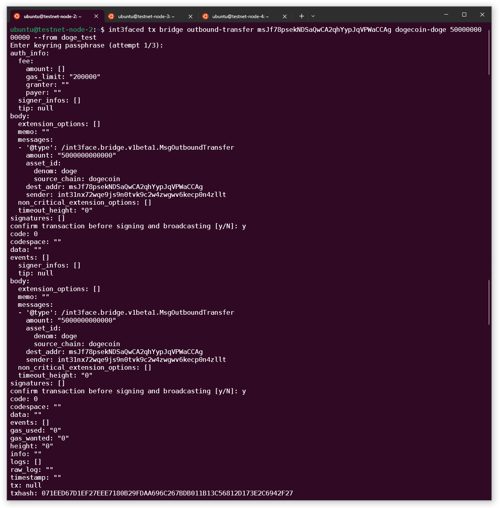

This is the demo of the inbound and outbound transfer flow in the Int3face for the DOGE tokens.

**Requirements**
1. Int3face node
2. Int3face observer (configured for the DOGE regtest)
3. [DOGE regtest node](./dogecoin_deploy.md)

We have everything deployed and ready in the Int3face testnet. Request Int3face team to get access to the testnet environment.

Current Dogecoin vault address: `mtjLBcip4TAy7kSEsVoYKK5zvz1YY1Zy4F`

# Inbound Transfer

We will use our own DOGE validators funds.

1. We need an int3 address to send funds to

We can generate new address by `int3faced keys add "$your_key_name"`.


We will use the address `int31nx72wqe9js9n0tvk9c2w4zwgwv6kecp0n4zllt`

2. Lets verify that this address doesn't have DOGE tokens in the Int3face
```sh
int3faced q bank balances int31nx72wqe9js9n0tvk9c2w4zwgwv6kecp0n4zllt
```


3. Select an UTXO to spend
```sh
dogecoin-cli listunspent 
```


If you don't see any UTXO available, mine a block to receive the rewards `dogecoin-cli generate 1`, and run `listunspent` command again.

4. Build raw transaction from the UTXO you selected

**Vins**
   * Take the `txid` and `vout` from the UTXO you're going to spend

**Vouts**
   * Add the DOGE vault address and the amount to send
   * Add the change address to get remaining tokens back (to get address of your current node run `dogecoin-cli getaccountaddress ""`)
   * Leave a small amount of tokens to pay the fee (1.0 should be enough)
   * Add `data` entry with the hex encoded recipient address
     * Encode `int31nx72wqe9js9n0tvk9c2w4zwgwv6kecp0n4zllt` at the (online converter)[https://www.rapidtables.com/convert/number/ascii-to-hex.html]

```sh
vins='[
    {
        "txid": "c4a12ff2916393d4a05ca446ab03d8cdf706dd6eb9b5d62eb8ab82cb08a01602",
        "vout": 0
    }
]'

vouts='{
    "mtjLBcip4TAy7kSEsVoYKK5zvz1YY1Zy4F": 100000.0,
    "mzd3LWrYrBD2qqiKwCcetReLtNC9Sfcr3j": 399999.0,
    "data": "696E7433316E783732777165396A73396E3074766B39633277347A77677776366B656370306E347A6C6C74"
}'

dogecoin-cli createrawtransaction "$vins" "$vouts"
```


5. We can verify that the transaction is correct
```sh
dogecoin-tx -regtest -json "$raw_tx"
```


6. Sign the transaction
```sh
dogecoin-cli signrawtransaction $raw_tx
```


7. Broadcast signed transaction to the DOGE
```sh
dogecoin-cli sendrawtransaction $signed_tx
```


8. Generate a block to include our transaction in the chain
```sh
dogecoin-cli generate 1
```

Now the transaction should be observed by the Observer and sent to the Int3face chain.

9. Check your balance on the Int3face chain.
```sh
int3faced q bank balances int31nx72wqe9js9n0tvk9c2w4zwgwv6kecp0n4zllt
```

Now, we can see DOGE tokens in our wallet.

# Outbound Transfer

Lets send some of our tokens back from Int3face to DOGE.

1. Generate a new DOGE address
```sh
dogecoin-cli getnewaddress
msJf78psekNDSaQwCA2qhYypJqVPWaCCAg
```

2. Request an outbound transfer from the bridge module
```sh
int3faced tx bridge outbound-transfer msJf78psekNDSaQwCA2qhYypJqVPWaCCAg dogecoin-doge 5000000000000 --from doge_test
```


3. We can check our balance again to see that DOGE tokens in Int3face were burt
```sh
int3faced q bank balances int31nx72wqe9js9n0tvk9c2w4zwgwv6kecp0n4zllt
```


4. Generate a block in DOGE to include transaction from the vault
```sh
dogecoin-cli generate 1
```

5. Check DOGE balance of the address we created before
```sh
dogecoin-cli listunspent 1 9999999 '["msJf78psekNDSaQwCA2qhYypJqVPWaCCAg"]'
```

Now, we can see DOGE tokens in our wallet.
