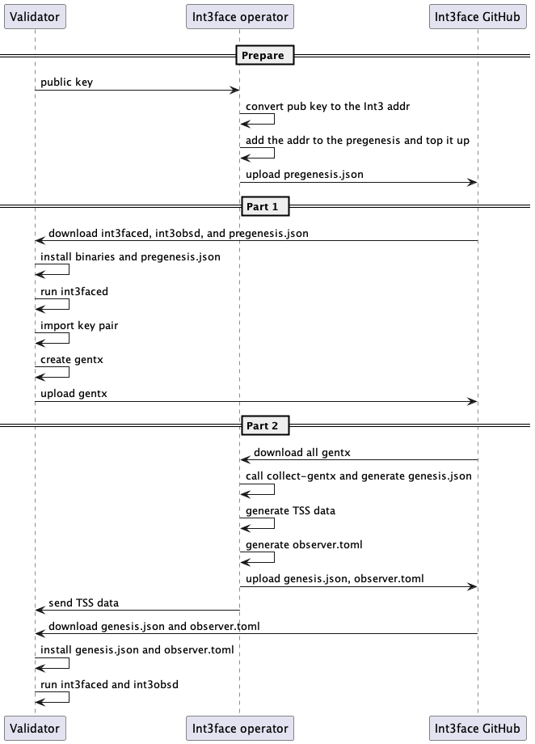

# Int3-test-1

Int3-test-1 is the first Int3face testnet aimed to test and benchmark the protocol. This testnet consists of for initial
validators hosted in the cloud.

## Deploy workflow

1. Validators who are willing to participate provide their public keys for the initial airdrop.
2. Int3face operator converts public keys to Int3face addresses and adds corresponding accounts to `pregenesis.json`.
3. Int3face operator includes the desired chain IDs in `pregenesis.json`.
4. Validators download the repositories and install `int3faced` and `int3obsd` binaries.
5. Validators download `pregenesis.json` and install it.
6. Validators run the `int3faced` binary.
7. Validators import their private/public key pairs into the Int3face chain to access balances (their public keys are
   already listed in `pregenesis.json`).
8. Validators create gentxs linked to their pregenesis balances.
9. Validators commit their gentxs to this repository.
10. Int3face operator collects all gentxs and generates a comprehensive `genesis.json` file.
11. Int3face operator creates all the TSS data for the validators and forms the `observer.toml` configuration file.
12. Int3face operator distributes the `genesis.json`, `observer.toml`, and corresponding TSS data among all validators.
13. Validators download `genesis.json`, `observer.toml`, and TSS data and install everything.
14. Validators run `int3faced` and `int3obsd`.

## Validators

### int3face-node-1 (not working)

| Field              | Value                                       |
|--------------------|---------------------------------------------|
| IP                 | 188.34.190.104                              |
| node_name          | int3face-node-1                             |
| chain_id           | int3-test-1                                 |
| tendermint_node_id | dcd1c6e5e94675e40f34c0d3ee1c1dace0a34cc0    |
| val_acc_address    | int31rc5tuqvvfh5sngwsegdq893zu9jfj64w7rnx4u |
| val_acc_name       | my_validator                                |

### int3face-node-2

| Field              | Value                                       |
|--------------------|---------------------------------------------|
| IP                 | 188.245.39.76                               |
| node_name          | int3face-node-2                             |
| chain_id           | int3-test-1                                 |
| tendermint_node_id | ae227853acb4c25fe2e9992703cb9e279933af41    |
| val_acc_address    | int31p3drpvllz0ewcjq20ucwdr6l76rka9ep04lz4p |
| val_acc_name       | my_validator_2                              |

### int3face-node-3

| Field              | Value                                       |
|--------------------|---------------------------------------------|
| IP                 | 188.245.39.74                               |
| node_name          | int3face-node-3                             |
| chain_id           | int3-test-1                                 |
| tendermint_node_id | 98d64b811200d6168ecd9d68d194944f512d4639    |
| val_acc_address    | int31djewruqsxw9nh6fuk96hgde7zpt3gtv7rwmec4 |
| val_acc_name       | my_validator_3                              |

### int3face-node-4

| Field              | Value                                       |
|--------------------|---------------------------------------------|
| IP                 | 188.245.39.49                               |
| node_name          | int3face-node-4                             |
| chain_id           | int3-test-1                                 |
| tendermint_node_id | 3902406e95eb247c3aef995ac04c9f4375313d1d    |
| val_acc_address    | int31dafm9d5a6j86r5lj7rh6a3n3zd7ul7mj5mc8jx |
| val_acc_name       | my_validator_4                              |
